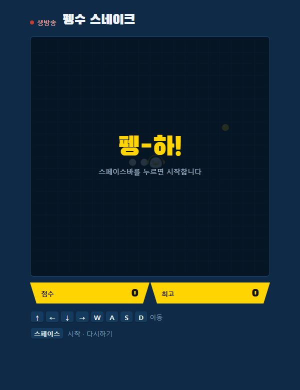
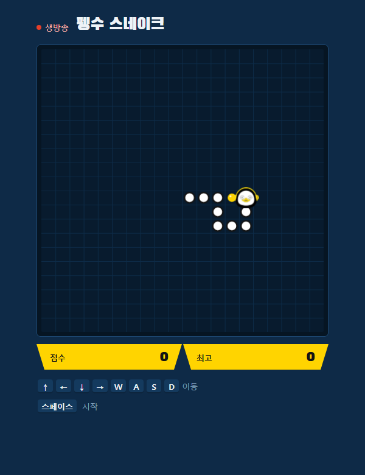
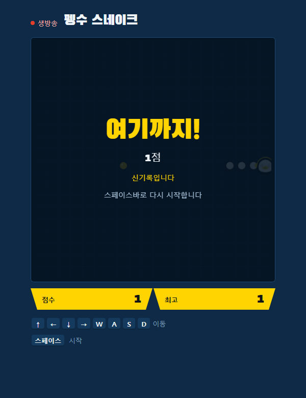
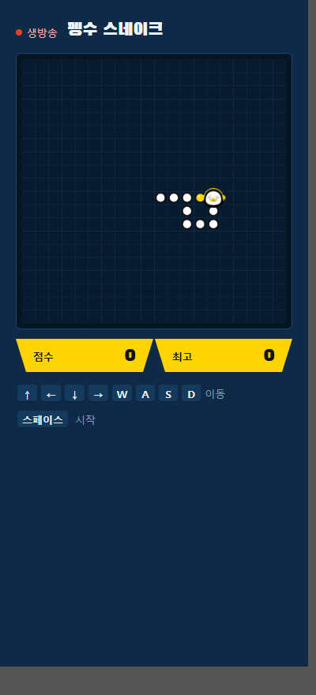

# 펭수 스네이크

펭수를 머리로 삼아 조작하는 브라우저 스네이크 게임입니다. 설치도 로그인도 없이
`index.html` 한 파일로 돌아갑니다. 2026년 EBS 신규사원 연수과정 실습 결과물입니다.



## 실행

`index.html`을 브라우저로 열면 됩니다. 스페이스바로 시작하고, 방향키 또는 WASD로
방향을 바꿉니다. 벽이나 자기 몸에 부딪히면 끝나고, 스페이스바로 바로 재시작합니다.
최고 점수는 브라우저에 남습니다.

## 구조

```
index.html               게임 전체 (마크업 · 스타일 · 로직)
assets/pengsoo-head.png  펭수 머리 스프라이트
PRD.md                   기획 문서 — 목표, 성공 지표, 시나리오, MVP 범위
tools/make_sprite.py     스프라이트 생성
tools/build_test.py      동작 점검
docs/screenshots/        시작 · 플레이 · 게임오버 · 모바일 화면
```

## 화면

| 플레이 | 게임오버 | 모바일 |
|---|---|---|
|  |  |  |

## 고지

펭수는 EBS의 캐릭터입니다. 이 게임은 연수 실습으로 만든 비상업적 결과물입니다.
